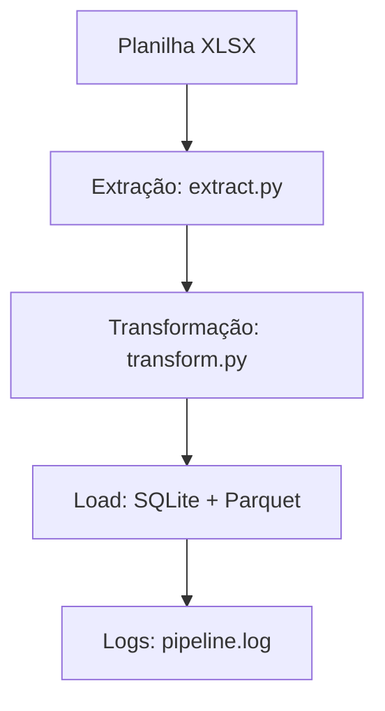

# 🚀 LogisticOps


## 🎯 Objetivo
Criar um sistema inteligente para otimização e automação de operações logísticas, com foco em coleta, análise e previsão de cargas, além de relatórios automatizados e integração com APIs.

---

## 🧱 Estrutura de Pastas
```
logisticops/
│── data_raw/              # Planilhas originais
│── data_processed/        # Dados limpos e normalizados
│── db/
│   └── logisticops.db     # Banco SQLite
│── logs/                  # Logs de execução
│── src/
│   ├── config.py          # Configurações globais
│   ├── extract.py         # Extração de dados
│   ├── transform.py       # Limpeza e normalização
│   ├── load.py            # Salvamento em SQLite e Parquet
│   ├── utils.py           # Funções auxiliares
│   └── pipeline.py        # Pipeline principal
│── README.md
│── requirements.txt
```

---

## 🔄 Fluxo do Pipeline


---

## 📦 Instalação
```bash
# Clone o repositório
git clone https://github.com/seuusuario/logisticops.git
cd logisticops

# Crie um ambiente virtual
python -m venv venv
source venv/bin/activate  # Linux/Mac
venv\Scripts\activate     # Windows

# Instale as dependências
pip install -r requirements.txt
```

---

## ▶️ Como Executar
```bash
# Rodar pipeline completo
python src/pipeline.py
```

---

## ⚙️ Automação (Windows Task Scheduler)
1. Abra o **Agendador de Tarefas**
2. Crie uma nova tarefa
3. Configure para rodar às 22h35
4. Ação:
```bash
python.exe C:\...\logisticops\src\pipeline.py
```

---

## ✅ Funcionalidades
- Carregamento automático da planilha
- Limpeza e normalização (colunas, datas, duplicados)
- Salvamento em **SQLite** e **Parquet**
- Logs detalhados
- Execução automática via scheduler

---

## 📜 Roadmap
- [x] Pipeline ETL completo
- [ ] Adicionar testes unitários
- [ ] Criar dashboard de monitoramento

---

## 🤝 Contribuição
Pull requests são bem-vindos! Para mudanças maiores, abra uma issue primeiro.

---

## 📄 Licença
Este projeto está sob a licença MIT.